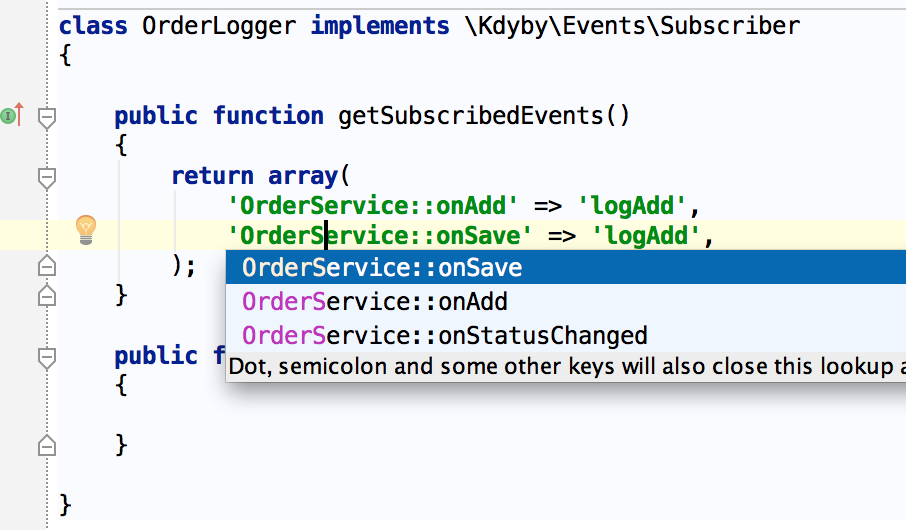

# PhpStorm + Kdyby Events

This plugin integrates the best IDE known as PhpStorm with the best php eventing library [Kdyby Events](https://github.com/Kdyby/Events).

## Features
- go to attached events on event declaration
- go to attached events on event invocation
- event names autocompletion

### Find attached events
Click on event definition and go to any attached handler.

### Event names autocompletion
Start typing event name within `getSubscribedEvents` and it will autocomplete available events.

